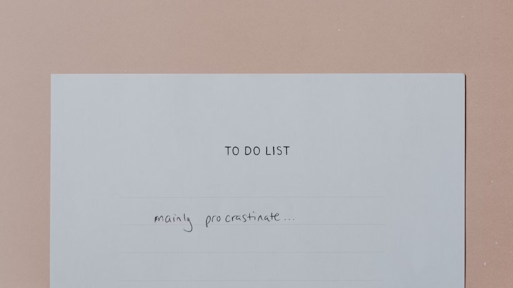

# Context

## 1. Design Task

Jane, a chronic procrastinator, is facing the common struggle of consistently putting off tasks until the last minute. This habit not only leads to burnout but also causes significant distress in her studying and work life. Recognizing the need for change, Jane is eager to break free from the cycle of procrastination, aiming to establish a stable rhythm in her daily responsibilities. Despite her determination, she feels uncertain about how to effectively alter her behavior and develop healthier habits. Your task is to design an anti-procrastination app that assists individuals like Jane in overcoming procrastination tendencies and fostering a more productive lifestyle. This app integrates persuasive elements to motivate and guide users toward breaking the procrastination cycle, empowering them to achieve their goals with greater efficiency.

## 2. Solution

Pulse empowers users like Jane by visualizing productivity through a "BPM" (Beats Per Minute) system, which mirrors a heartbeat that accelerates with each task completed. This real-time feedback creates an engaging and motivating experience. Pulse allows users to set and track goals, break them into manageable subtasks, work in focused sessions, and review daily progress. Through persuasive elements, the app motivates and guides users toward sustained productivity, helping them achieve their goals more easily and efficiently.
