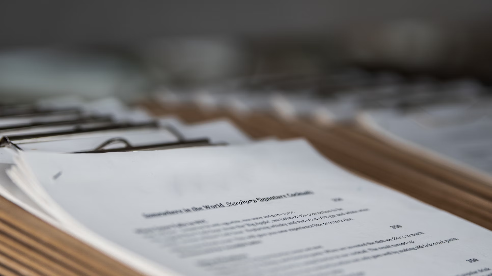
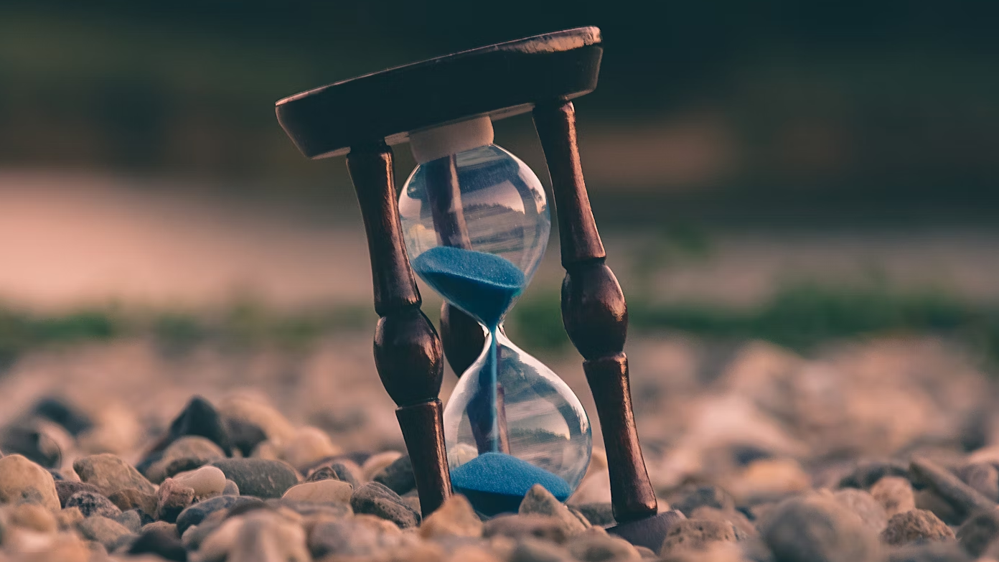
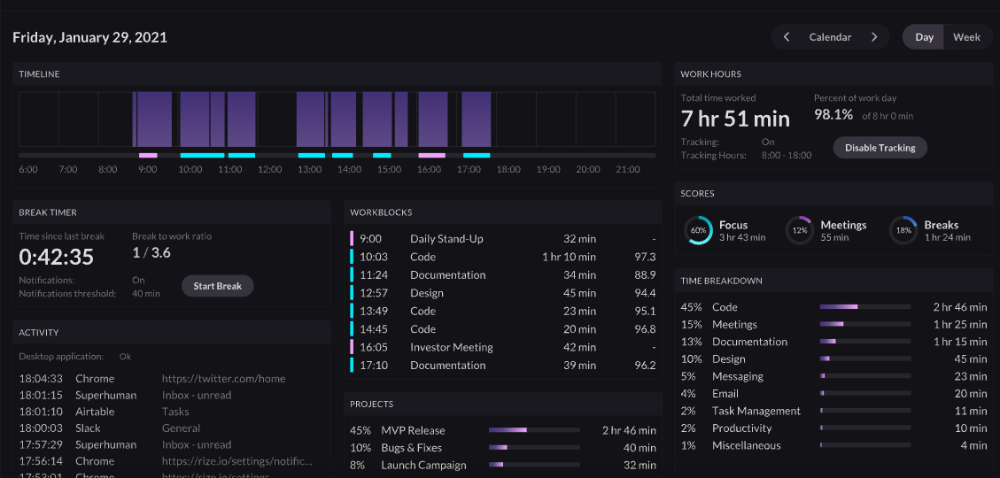
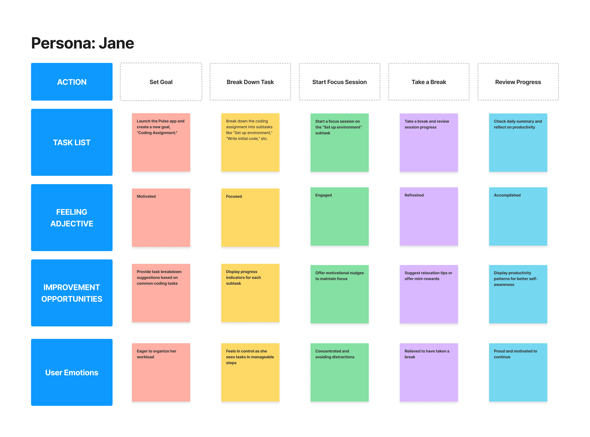

# User Requirements

## 1. Target User

Pulse is designed for university students, a group often challenged by procrastination due to the demands of academic life. Students in this environment face fewer external structures pushing them to complete tasks, leaving them with greater freedom—and responsibility—to manage their own time. Balancing academics, social life, and personal responsibilities requires strong time-management skills, which can be hard to maintain.

Targeting university students allows Pulse to cater to those who would benefit most from a productivity tool focused on fighting procrastination. This stage of life is full of juggling priorities, self-discipline, and exploring interests and goals. By addressing procrastination directly, Pulse aims to help students stay on top of tasks, avoid last-minute stress, and improve their productivity both in school and beyond.

## 2. Features

Based on the conceptual understanding of the design task and of competing products, the following features were chosen.

### 2.1. Goal Breakdown into Subtasks

**Conceptual Understanding:**

Procrastination often happens because large tasks feel overwhelming. Research in behavioral design shows that breaking big tasks into smaller, manageable steps can make them seem less daunting, which encourages people to get started. This method, known as "chunking," aligns with productivity techniques like the Pomodoro method, which help users feel progress step-by-step, making it easier to start and keep going.

**Competing Products:**

Many productivity apps, like [Todoist](https://todoist.com/), let users break tasks into subtasks, making big projects more approachable. However, these apps often lack personalized motivational prompts or reminders, which can be especially helpful for procrastinators who need focused guidance on one task at a time. Pulse aims to fill this gap by combining task breakdown with real-time feedback, boosting motivation for users like Jane.

**Feature Details:**

- Subtasks for Goals
- Prioritization and Tagging
- Progress Tracking and Feedback

---

### 2.2. Focused Sessions with Timed Intervals

**Conceptual Understanding:**

Focused work sessions, often structured through time-blocking, are based on research showing that setting specific periods for concentrated work boosts productivity and reduces procrastination. Techniques like the Pomodoro method, where users work in intervals with breaks, help sustain focus and manage mental energy. These time-limited sessions give users a sense of progress, which reinforces motivation to keep working productively.

**Competing Products:**

Focus apps like [Forest](https://www.forestapp.cc/) encourage users to stay on task with timed sessions, sometimes enhanced with nature sounds or background music. However, they often lack integration with broader task or goal tracking. Pulse addresses this by combining timed focus sessions with task feedback, making each session more purposeful and productive.

**Feature Details:**

- Focus Sessions for Subtasks
- Break Reminders and Feedback
- Productivity Intensity Visualization.

---

### 2.3. Daily Productivity Tracking

**Conceptual Understanding:**

Self-monitoring helps users spot productivity trends and find areas to improve. By tracking productivity daily, users can see short-term progress and recognize patterns over time. Additionally this approach motivates users to adjust and adopt better strategies.

**Competing Products:**

Apps like [Rize](https://rize.io/) track time spent on tasks, providing productivity insights. Pulse offers similar daily tracking, enabling users like Jane to link her work habits directly to her productivity outcomes.

**Feature Details:**

- **Total Focus and Break Time**: Review total focus time and break time for today
- **Categorized Task Focus**: View focus time across different categories (e.g., “Study,” “Exercise,” “Social”)
- **Interruption Tracking**: Records interruptions, such as time spent on social media or video platforms

---

## 3. User Task

- **User Task 1**: Jane wants to organize and prioritize her workload by breaking down a goal into manageable subtasks.
- **User Task 2**: Jane wants to stay engaged and productive by working in focused sessions
- **User Task 3**:Jane wants to track her productivity for the current day and reflect on her progress to understand patterns in her work habits.

_Note that each of the features mentioned in section 2.2 corresponds to each of the user tasks above_.

## 4. User Journey Map

**Scenario**:

Jane wants to finish her coding assignment on time without getting overwhelmed. As a busy university student juggling multiple courses, she often battles procrastination, which affects her organization and deadlines. To stay on track, she decides to use the Pulse app, which helps structure tasks and visualize productivity.

Jane opens Pulse on her phone. She goes to the Task Management section, adds a new goal called “Coding Assignment,” and divides it into subtasks: “Set up environment,” “Write initial code,” “Debug,” “Optimize code,” and “Final testing.”

With her assignment organized, Jane starts on the first subtask: “Set up environment.” She initiates a focus session for this task. Pulse lets her set a timer, and she chooses a 25-minute focus period with a 5-minute break to help her concentrate.

As she works, Jane sees her productivity increase in real-time with Pulse’s BPM (Beats Per Minute) visualization, which keeps her motivated. When the session ends, Pulse prompts her to take a short break, showing her the progress she’s made.

At the end of the day, Jane checks Pulse’s daily summary to review her achievements. She sees the total time spent on her assignment and her BPM rising with each session, boosting her sense of accomplishment. This reflection helps her feel in control and ready to tackle the remaining tasks in the days ahead.

**Expectations**:

- Have a clear plan to tackle her coding assignment.
- Stay focused on individual subtasks without getting distracted.
- Feel a sense of progress and accomplishment through visual feedback.
- Identify areas for improvement based on her productivity pattern
  

[View Image](Attachments/2_User_Requirements.png)
